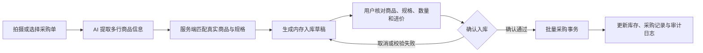
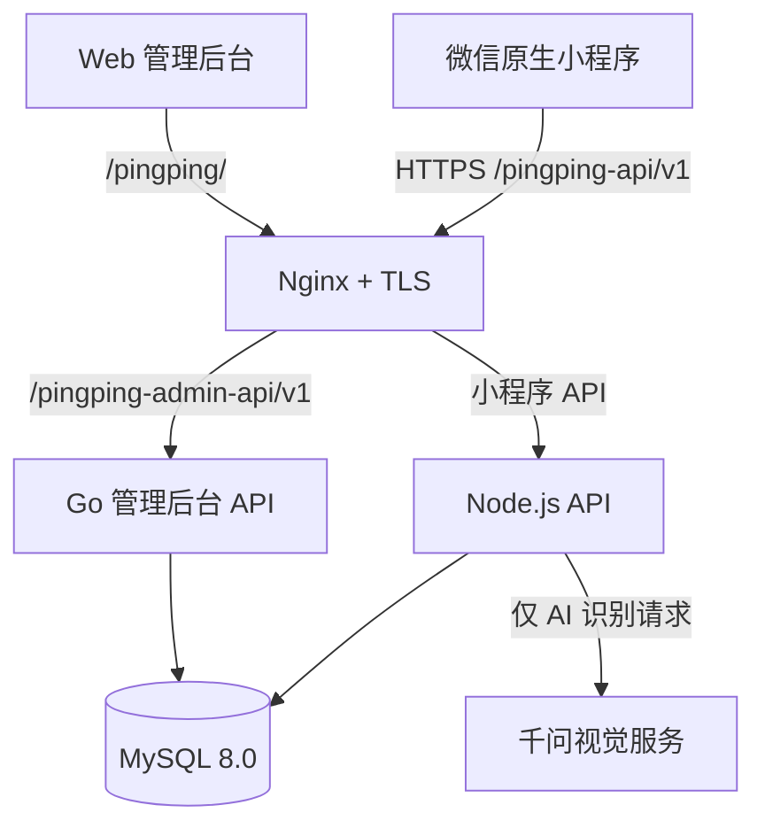

# 萍萍小助手 v1.2.0

面向小型服装、美妆零售门店的轻量经营管理系统。项目包含微信原生小程序、Vue 3 Web 管理后台、Node.js 小程序 API、Go 管理后台 API 和 MySQL 数据库，覆盖商品、库存、销售、采购、账本、经营分析与员工权限管理。

> v1.2.0 在原有经营闭环上增加 AI 商品识别与 AI 拍照入库辅助流程。AI 只负责提取信息和提供匹配建议，真实商品数据来自业务数据库，库存变化必须经人工确认并由服务端事务完成。

| 在线入口 | 地址 |
| --- | --- |
| Web 管理后台 | [https://shanshanwink.online/pingping/](https://shanshanwink.online/pingping/) |
| 小程序 API | `https://shanshanwink.online/pingping-api/v1` |
| 管理后台 API | `https://shanshanwink.online/pingping-admin-api/v1` |

## 1. 项目简介

萍萍小助手采用“小程序高频操作、Web 低频管理”的产品分工：

- 微信小程序用于卖货、拿货、记账、库存查询和 AI 辅助识别。
- Web 管理后台用于商品维护、库存核对、经营分析、员工权限和审计。
- Node.js 服务承载小程序登录、同步、经营事务和 AI 辅助流程。
- Go 服务承载管理后台登录、权限校验、经营数据读取和审计。
- 两个服务共享同一 MySQL 和 `storeId`，但使用相互独立的登录会话。

项目不是演示数据看板：销售、采购、库存与账本均来自真实业务状态，前端不补造经营数据。

## 2. 项目背景

小型零售门店常使用纸笔、表格或聊天记录管理商品。服装存在颜色、尺码等多规格库存，美妆商品还涉及品牌、批次和有效期，容易出现查询慢、重复录入和账实不一致。

本项目希望在不过度增加操作成本的前提下，形成一套可落地的经营闭环：

1. 小程序完成日常高频经营操作。
2. Web 后台集中管理商品、员工和经营分析。
3. AI 缩短图片查询和采购单录入路径，但不替代人工业务决策。
4. 服务端通过事务、幂等和审计保证经营数据可信。

## 3. v1.2 核心亮点

- **AI 商品助手**：拍摄或选择商品图片，识别包装文字和商品特征，并与门店真实商品库进行匹配。
- **AI 拍照入库**：识别采购单中的多行商品，生成可编辑入库草稿，用户核对后统一提交。
- **可信商品匹配**：真实货号 `itemNumber` 优先，名称、品牌、规格和类型用于组合匹配，内部流水号 `code` 仅作兼容回退。
- **商品生命周期治理**：停用商品不参与普通交易和普通 AI 匹配，支持重新启用，历史经营记录始终保留。
- **批量采购事务**：多行采购在同一数据库事务中提交，任一行失败则整体回滚，并支持批次幂等与冲突检测。
- **正式 HTTPS 部署**：通过 Nginx 和 HTTPS 对外提供 Web、Node API 与 Go API，并使用独立路径隔离同域名下的多个项目。

## 4. 微信小程序功能

底部导航固定为“首页、商品、账本、我的”，高频操作从明确入口进入。

| 模块 | 主要功能 |
| --- | --- |
| 首页 | 今日销售、今日盈利、库存预警、近期记录和快捷经营入口 |
| 商品 | 服装与美妆商品档案、规格库存、搜索、详情、维护和 AI 商品助手 |
| 卖货 | 按真实规格扣减库存，记录销售收入、成本和操作日志 |
| 拿货 | 按真实规格增加库存，记录采购支出并更新成本 |
| 账本 | 销售收入、采购现金支出、其他收入、其他支出和经营盈利 |
| 我的 | 用户资料、同步状态、操作记录、后台地址、版本信息和退出登录 |

## 5. Web 后台功能

Web 管理后台使用 Vue 3 + Vite 构建，配套独立的 Go API 和后台会话，不复用微信登录令牌。

- **经营看板**：查看经营指标、库存预警和商品概览。
- **商品中心**：维护商品资料、价格、图片和销售状态。
- **库存中心**：查看与核对聚合库存和库存流水。
- **销售与收支**：只读核对销售、采购和其他收支记录。
- **经营分析**：按时间范围查看收入、成本、毛利和经营盈利。
- **员工与权限**：管理账号、角色、状态和细粒度权限。
- **操作日志**：合并查看小程序与管理后台的重要操作记录。

权限判断由 Go 服务端完成。前端可以按权限隐藏入口，但不作为安全边界。

## 6. AI 商品助手

AI 商品助手通过 DashScope 兼容接口调用千问视觉模型。模型只提取受控的商品特征，随后由 Node.js 服务与门店真实商品数据进行本地匹配。

匹配主要参考：

- 图片中明确可见的真实货号与商品档案 `itemNumber`；
- 商品名称、品牌和类别；
- 颜色、尺码、容量等规格信息；
- 识别置信度、候选得分及候选间差距。

匹配结果分为三类：

- **唯一匹配**：满足置信度、得分和候选差距要求，可直接进入商品详情。
- **候选商品**：最多展示三个合理候选，由用户选择正确商品。
- **无匹配**：明确提示未找到商品，不自动创建商品。

页面展示的售价、库存和历史进货信息均来自业务数据库，不采用 AI 返回的经营字段。

## 7. AI 拍照入库流程



识别阶段只生成草稿，不写数据库。存在以下情况时必须人工处理后才能确认：

- 没有找到对应商品；
- 出现多个合理候选；
- 无法唯一确定商品规格；
- 数量、进价或行金额缺失、异常。

用户确认后，小程序只提交商品、规格、数量、进价等最小可信字段；服务端不会采纳 AI 生成的库存、售价或商品主键。

## 8. AI 可信边界

项目将 AI 定位为录入与查询助手，而不是经营数据决策者：

- AI 不自动创建商品或规格。
- AI 不直接修改库存、价格、成本或账本。
- AI 不生成 `productId`、`adminProductId`、`specId` 或内部流水号 `code`。
- 真实货号只命中已停用商品时返回 `inactive_match`，不允许自动确认入库，也不会因此创建同货号新商品。
- 低置信度结果不会强制判定为唯一商品。
- 识别结果必须通过字段白名单和类型校验。
- 真实库存、售价和进货记录只从门店数据库读取。
- 拍照入库必须经过人工核对和二次确认。
- AI 功能受门店 Feature Flag、登录鉴权、图片格式与大小限制、并发限制和频率限制保护。
- 上游 AI 错误经过脱敏处理，不向小程序透传密钥或原始响应。

## 9. 技术架构



| 层级 | 技术与职责 |
| --- | --- |
| 小程序 | 微信原生小程序，页面负责状态与交互，共享业务逻辑位于 `utils/` |
| Web | Vue 3、Vite，负责低频管理、核对与经营分析 |
| Node API | Node.js 18+，负责微信会话、状态同步、AI 辅助流程和小程序经营事务 |
| Go API | Go 1.22+，按 `http → service → repository` 分层，负责后台会话、RBAC 和审计 |
| 数据库 | MySQL 8.0，保存门店状态、后台商品、账号权限和审计记录 |
| 部署 | Ubuntu、Nginx、systemd、HTTPS，Node/Go/MySQL 仅监听服务器本机地址 |

## 10. 数据一致性设计

- **原子批量入库**：一个采购草稿中的多行记录在同一事务内完成，商品、库存或审计任一环节失败都会整体回滚。
- **幂等提交**：批次 ID 与稳定行 ID 用于识别重复请求；完全相同的重试不会重复增加库存，内容变化的同批次请求返回冲突。
- **服务端最终状态**：入库成功后，小程序使用服务端返回的门店状态刷新本地库存，不在客户端自行叠加。
- **真实审计记录**：每行采购都会生成采购记录、库存操作记录和带批次信息的服务端审计日志。
- **安全删除**：只有 owner 可永久删除零库存且无销售、采购、库存操作和业务审计历史的商品；有任何经营历史只能停用，删除后 `code` 不重排、不复用。
- **统一经营口径**：经营盈利为“可靠成本销售毛利 + 其他收入 - 其他支出”；采购属于现金支出，不重复从经营盈利中扣除。
- **不伪造成本**：缺少可靠成本的销售计入收入，但不伪造毛利，也不计入经营盈利。

当前小程序以 `store_states` 中的 `products[].specs[]` 保存规格库存，Web 的 `admin_products` 保存聚合库存。两者粒度不同，跨端读取与同步由服务端兼容，不在前端改写库存规则。

## 11. 正式部署

项目已通过正式域名和 HTTPS 提供访问入口：

- 个人主页：`https://shanshanwink.online/`
- Web 管理后台：`https://shanshanwink.online/pingping/`
- Node 小程序 API：`https://shanshanwink.online/pingping-api/v1`
- Go 管理后台 API：`https://shanshanwink.online/pingping-admin-api/v1`

Nginx 使用 `/pingping/`、`/pingping-api/v1/` 和 `/pingping-admin-api/v1/` 隔离萍萍小助手的静态资源与两个 API，避免与同域名下其他项目相互回落。迁移期旧路径 `/admin/`、`/api/v1/` 和 `/admin-api/v1/` 仍兼容访问。

微信公众平台的 request、uploadFile 和 downloadFile 合法域名统一配置为 `https://shanshanwink.online`。部署、备份、健康检查与回滚步骤见[自有云服务器部署说明](docs/guides/自有云服务器部署说明.md)。

真实 AppSecret、数据库密码、AI API Key、JWT 密钥、私钥和生产环境文件均不进入仓库。

## 12. 测试保障

项目使用 Node.js 原生测试、静态语法检查、Vue production build 和 Go 测试构建验证主要边界。

重点覆盖：

- AI Feature Flag、鉴权、图片上传限制、频率限制和错误脱敏；
- 唯一匹配、候选匹配、无匹配和跨门店数据隔离；
- AI 采购单字段白名单、异常数据和人工核对状态；
- 批量采购整体回滚、重复提交幂等、并发提交和审计失败回滚；
- 小程序页面路由、正式 API 地址、Web 后台鉴权与 Go 权限规则。

常用验证命令：

```bash
# 仓库根目录
node --test tests/*.test.js

# Node API
cd server
pnpm run check

# Vue 管理后台
cd ../admin
pnpm build

# Go 管理后台 API
cd ../server-go
go test ./...
go build ./...
```

小程序页面或配置变化还需要在微信开发者工具中编译，并在不写入生产测试数据的前提下完成人工核对。

## 13. 版本演进

| 版本 | 主要内容 |
| --- | --- |
| v1.0 | 完成小程序经营闭环、Vue 管理后台、Node/Go 双服务、MySQL 数据与权限审计 |
| v1.1 | 增加 AI 商品图片识别、真实商品匹配、Feature Flag 和 AI 安全边界 |
| v1.2 | 增加 AI 拍照入库、真实货号治理与优先匹配、商品编辑纠错、停用/重新启用闭环和安全删除，并迁移到正式 HTTPS 与独立项目路径 |

## 14. 后续规划

- 建立更完整的匿名化商品图片与采购单评测集，持续评估识别准确率和人工修正率。
- 完善 AI 请求耗时、失败原因和使用频率监控，不记录敏感图片内容。
- 在保持现有兼容路径的前提下，逐步评估规格库存与后台聚合库存的统一数据模型。
- 完善自动化部署、证书到期提醒、备份恢复演练和线上健康检查。
- 根据真实门店使用反馈优化交互，不为展示目的增加空壳功能。

## License

本项目使用 [MIT License](LICENSE)。
