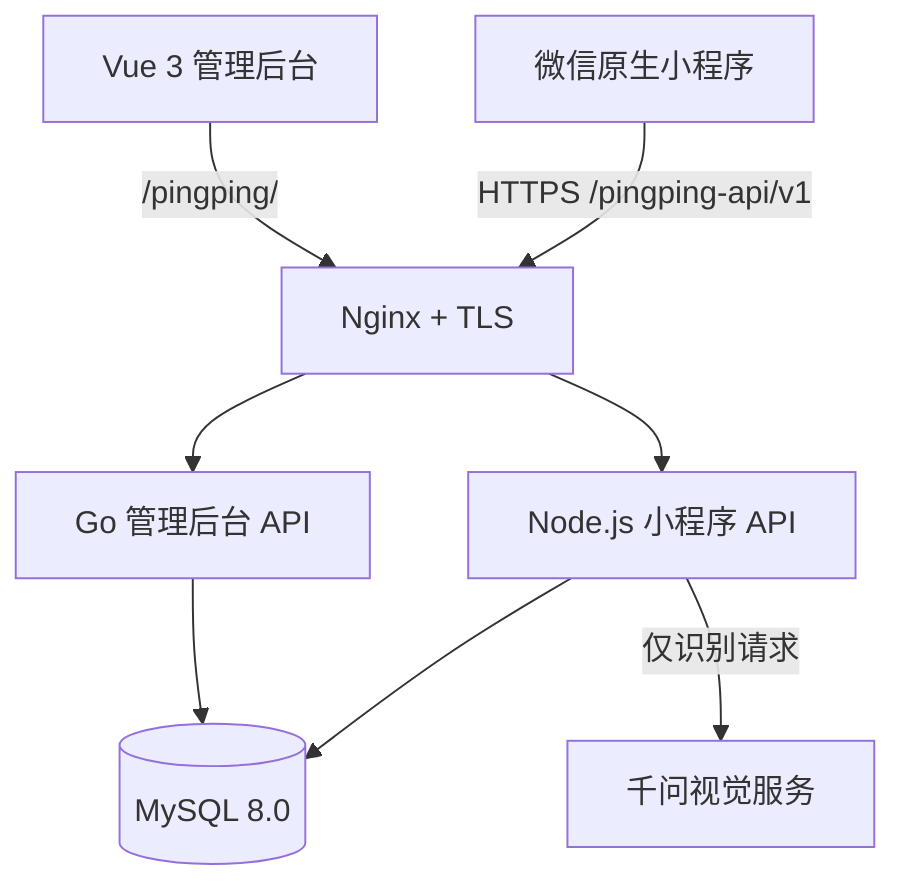

# 萍萍小助手 v1.0.1

面向小型零售门店的轻量经营管理系统，以服装经营为主要设计背景，当前同时支持美妆商品。项目包含微信原生小程序、Vue 3 Web 管理后台、Node.js 小程序 API、Go 管理后台 API 和 MySQL。

## 在线体验

| 入口 | 地址 |
| --- | --- |
| Web 管理后台 | [https://shanshanwink.online/pingping/](https://shanshanwink.online/pingping/) |
| 小程序 API 健康检查 | [https://shanshanwink.online/pingping-api/v1/health](https://shanshanwink.online/pingping-api/v1/health) |
| 管理后台 API 健康检查 | [https://shanshanwink.online/pingping-admin-api/v1/health](https://shanshanwink.online/pingping-admin-api/v1/health) |

小程序 v1.0.1 已正式上线，并准备了独立的面试 Demo 店：用户可在登录页点击“体验一下”进入；体验账号是 `clerk`，只能访问演示数据，可查看商品、库存和经营数据，也可体验卖货、拿货；不能编辑商品、永久删除、管理员工、修改设置、导出或访问真实门店。

## 为什么做

小型门店经常依赖纸笔、表格或聊天记录管理商品。服装又有颜色、尺码等多规格库存，容易出现查货慢、漏记交易和账实不一致。萍萍小助手把高频经营动作放在手机端，把低频维护和分析放在 Web，形成一套不过度复杂的经营闭环。

## 核心功能

### 微信小程序

- 首页：今日销售、经营盈利、库存预警和最近操作。
- 商品：服装/美妆档案、真实货号、规格库存、搜索和详情。
- 经营：卖货扣库存、拿货增库存、其他收支和操作记录。
- 账本：销售收入、采购现金支出、其他收支与统一经营口径。
- AI 辅助：商品图片识别、采购单拍照识别和人工确认入库。

正式 TabBar 固定为“首页、商品、账本、我的”。

### Web 管理后台

- 经营看板、商品中心、库存中心。
- 销售与收支核对、经营分析。
- 员工与权限、操作日志。
- 商品图片、状态、真实货号和安全删除管理。

Web 使用独立后台账号与 Go 会话，不复用微信令牌。权限由服务端判断，前端隐藏入口不作为安全边界。

## 商品真实货号

- `itemNumber` 是用户真实货号，可手动填写，也可由 AI 从图片中识别辅助。
- `code` 是系统内部兼容流水号，不面向普通用户展示，不充当真实货号。
- `productId`、`adminProductId`、`specId` 只用于内部关联。
- 新建商品可按规格设置非负整数初始库存；未填写时为 0。

## 停用与安全删除

- 停用商品不参与普通经营和普通 AI 匹配，历史记录仍然保留。
- 有经营历史的商品不能永久删除，只能停用。
- 只有 owner 可以永久删除零库存、无销售/采购/库存操作/审计历史的误建商品。
- 删除不会重排或复用内部 `code`。

## AI 能做什么

- 从商品图片提取受控特征和明确可见的真实货号。
- 在当前门店真实商品库中返回唯一匹配、候选商品或无匹配。
- 从采购单图片提取多行商品信息，生成可编辑的入库草稿。

## AI 不能做什么

- 不自动创建商品或规格。
- 不生成内部 ID 或内部 `code`。
- 不直接修改库存、售价、成本或账本。
- 不采用模型返回的库存、价格或商品主键。
- 不绕过人工核对；商品、规格、数量和进价确认后才由服务端事务入库。

## 系统架构



| 模块 | 职责 |
| --- | --- |
| 微信小程序 | 高频经营操作、本地交互与同步状态 |
| Vue 3 + Vite | 低频管理、核对和经营分析 |
| Node.js | 微信/Demo 会话、小程序同步、卖货/拿货事务、AI 辅助流程 |
| Go | Web 会话、RBAC、商品/库存/经营数据、员工权限和审计 |
| MySQL 8.0 | 门店状态、后台业务表、会话、权限与审计数据 |
| Nginx + systemd | HTTPS、静态资源和两个 API 的进程管理 |

Node 与 Go 共享同一 MySQL 和 `storeId`，但使用独立会话。小程序规格库存位于 `store_states`，Web 商品表保存聚合库存，当前通过服务端兼容层保持一致，不在前端伪造或换算经营数据。

## 数据与交易安全

- 卖货、拿货和批量入库均由服务端事务提交。
- 批量入库支持幂等重试和冲突检测，任一行失败则整体回滚。
- 经营盈利口径为“可靠成本销售毛利 + 其他收入 - 其他支出”。采购属于现金支出，不重复从经营盈利扣除。
- 缺少可靠成本的销售计入收入，但不伪造毛利。
- 真实凭据、AppID、AppSecret、数据库密码、AI Key、JWT Secret 和私钥不进入仓库。

## 项目结构

```text
admin/          Vue 3 管理后台
pages/          微信小程序页面
utils/          小程序共享业务逻辑、鉴权与同步
server/         Node.js API、迁移、Nginx/systemd 示例
server-go/      Go 管理后台 API
tests/          Node 与跨端静态回归测试
docs/product/   正式产品说明书
docs/guides/    长期部署与回滚说明
```

仓库不保存开发过程截图和一次性部署包；面试展示以正式 Web 地址和小程序 Demo 店为准。

## 测试与质量保障

```bash
# 仓库根目录
node --test tests/*.test.js

# Node API
cd server
pnpm run check

# Vue 管理后台
cd ../admin
pnpm build

# Go API
cd ../server-go
gofmt -l .
go test ./...
go build ./...
```

测试覆盖登录与门店隔离、Demo clerk 权限、规格库存、真实货号、卖货/拿货事务、批量入库幂等与回滚、AI 字段白名单、停用与安全删除、Web 权限和小程序路由。页面变化还需在微信开发者工具中编译并真机核对。

## 版本状态

v1.0.1 已完成功能收口、正式 HTTPS 部署和微信小程序上线，不再扩展功能。完成最终 GitHub 同步后正式封版。

完整产品边界见[产品说明书](docs/product/萍萍小助手-PRD.md)，部署、环境变量、迁移和回滚见[自有云服务器部署说明](docs/guides/自有云服务器部署说明.md)。

## License

[MIT License](LICENSE)
